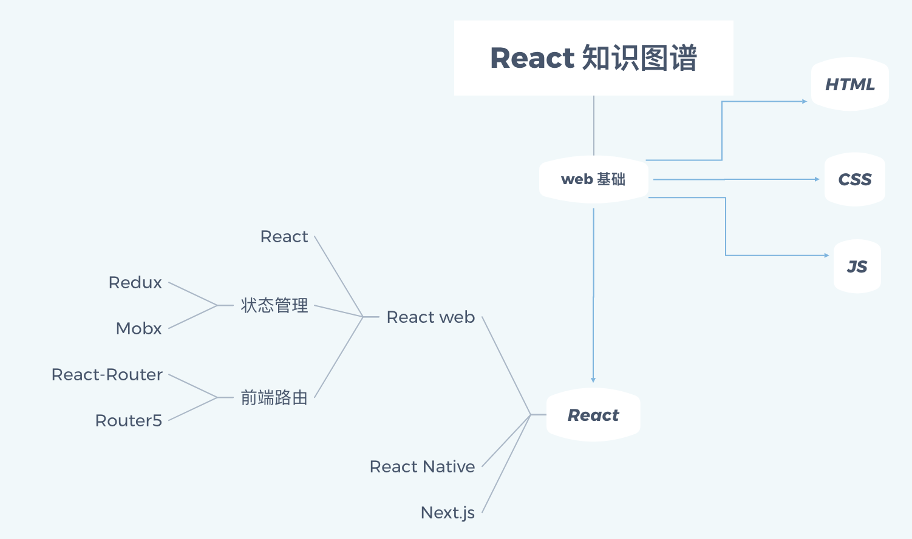

# React-Breadcrumb-Navigation 开发文档

React-Breadcrumb-Navigation 是一个面包屑导航（BreadcrumbNavigation）组件.

## 它的思路是：

### 1. 页面导航参数配置

用户新打开一个页面，将页面的 path（从 history.location 获得），title（用户即 开发者/模块使用者 灵活自定义）、和其他自定义属性加入会话历史缓存；
参数 | 描述
:-:|:-:
path | 页面路径，可以用于导航跳转
title | 可课自定义的显示给用户的页面标题
pageSnapShot | 页面快照，用于鼠标悬停在相应的标题时在一个小框内为用户显示页面快照
NodeLevel | 当前页面的级别，

## 2. 用 indexDB 存储会话历史

由于浏览器的 window.history API 实际上存储的是一个Tab页中的会话历史，如果我们在一个web APP 中跳转到另一个 APP 的页面，此时这个 Tab 页面的 history 实际上是两个 APP 合起来的历史。所以我们不能用浏览器本身的 history 作为存储我们面包屑历史的对象，不仅是因为前面的原因，还有我们需要自定义我们的面包屑会话历史，比如我们给每一个历史页面配置页面的标题，甚至页面的快照（鼠标悬停的时候可以现实页面快照）。所以我们可以使用浏览器的客户端存储来存储会话历史，比如 indexDB.

### 3. 生成页面快照

用户在离开一个页面的时候，为此页面生成一个快照。我使用了 [rasterizehtml](https://github.com/cburgmer/rasterizeHTML.js/wiki/API) 这个库可以把 HTML 转化为浏览器 canvas 中的图片。我想了两种办法：

1. 在用户离开页面之前就为当前页面生成 canvas，然后将其转化为图片（可以以 Blob 或者将 Blob 再转化为 base64 ），最后和页面的 path、title 仪器存储到会话历史。后面显示页面快照的时候直接把图谱显示出来就可以了。

2. 将页面的 document 字符串 存储起来，而不是转化为图片再存储。然后后面需要显示页面快照的时候，就需要动态的把对应的 页面document 转化为 canvas 图片。

对比上面两种方法以选出更好的方案。需要从 快照存储容量大小 和 快照显示速度 这两个方面对比。选择第一种方案。

## 开始开发

我们以下面的 React 知识图谱做一个路由demo，作为开发此面包屑导航组件的环境。图上的每个节点就是一个页面。

## 注意事项
1.  React、React-dom包应该装在 devDependencie 中，也就是开发组件包用的 React、React-dom 应该使用 npm i -D 下载。因为在使用此包的项目中已经有 React 和 Recat-dom 了，如果不把 React 和 Recat-dom 从依赖中去掉，就会造成包重复，项目会报错。

## 遗留问题
1. 页面快照中不能包含动态生成的部分。
2. 组件发布到 npm 后，在项目中使用从 npm 下载的面包屑组件包，组件中的图片显示不出来